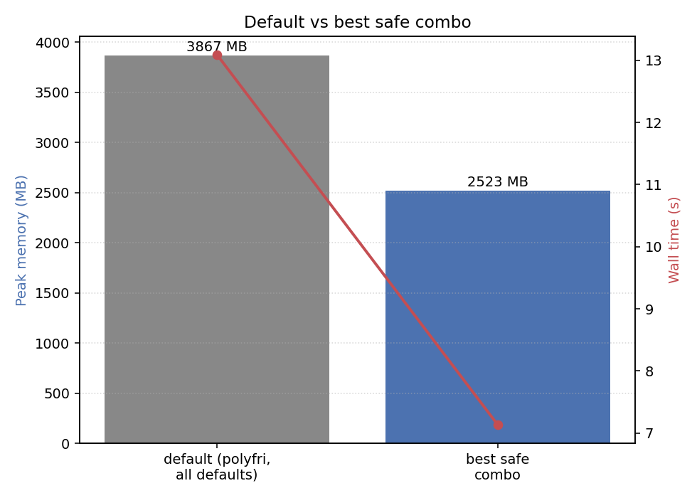
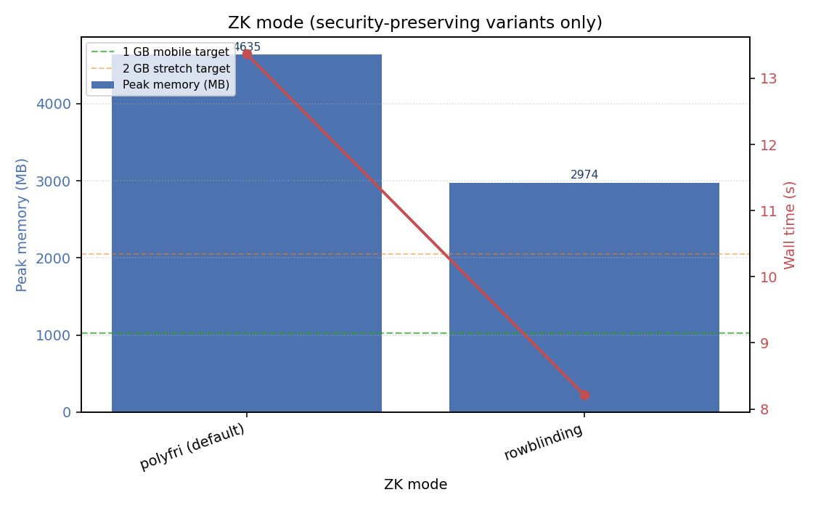
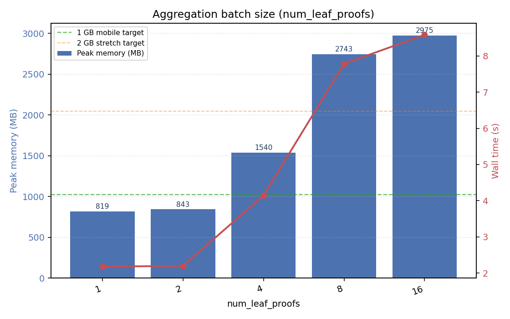
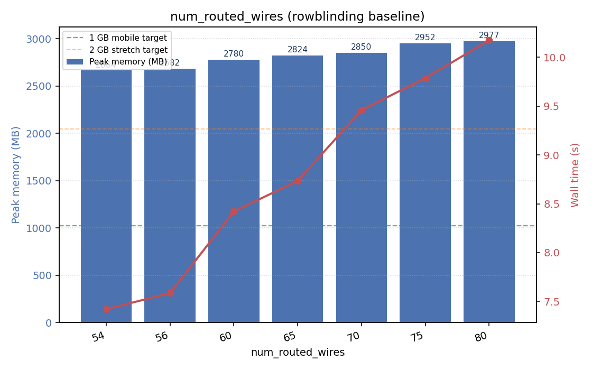
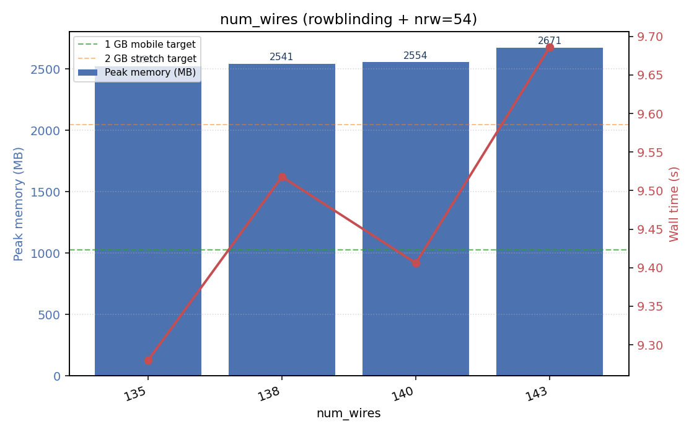
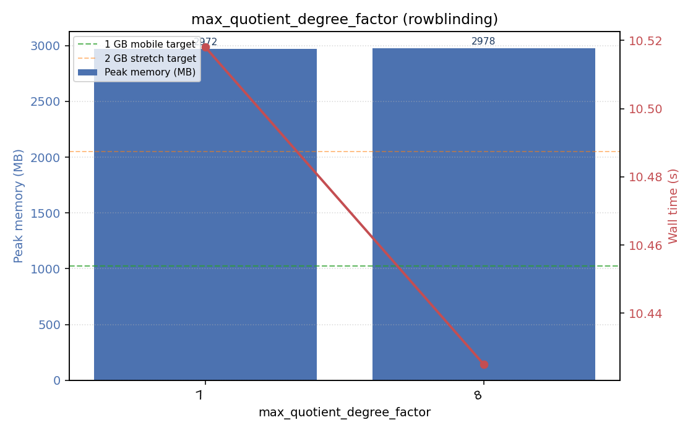
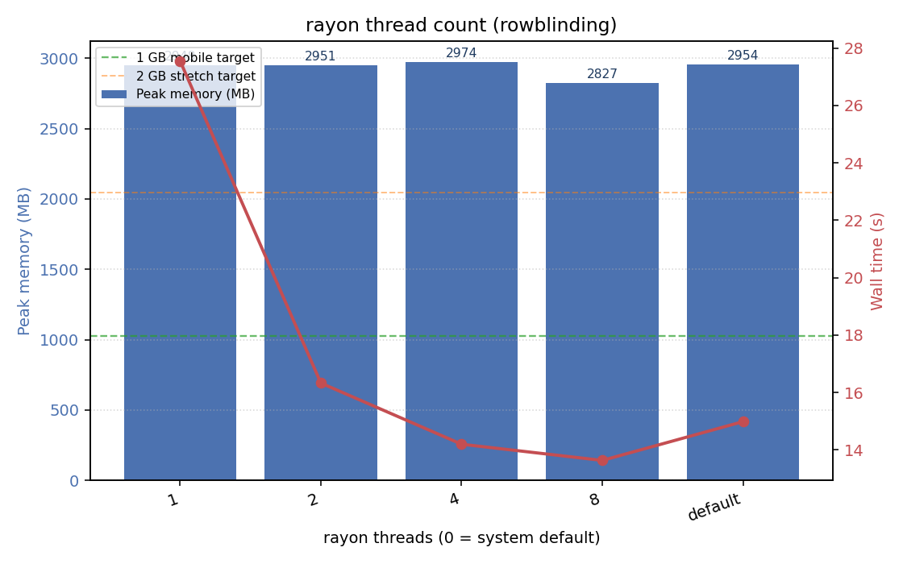
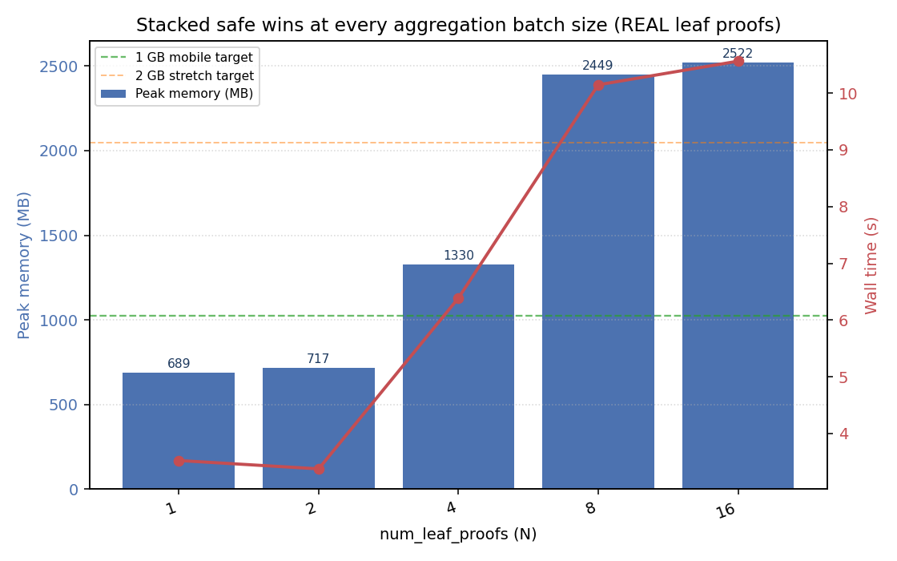

# Wormhole memprof — parameter sweep

Each sweep below varies a single circuit knob while keeping the rest at their defaults (or at the rowblinding baseline where noted). All configurations preserve full cryptographic security; weakening knobs (`zk-mode disabled`, lowering `security_bits`, etc.) are excluded.

## Headline result

| config | peak (MB) | wall (s) |
|--------|-----------|----------|
| default (polyfri, 16 leaves, all defaults) | 3867 | 13.09 |
| **best safe combo** | **2523** | **7.13** |
| Δ | -1344 MB (35%) | -5.96 s (46%) |

Best safe combo flags: `--skip-leaf-gen --real-proofs 1 --num-leaf-proofs 16 --zk-mode rowblinding --num-routed-wires 54 --num-wires 135`

## ZK mode (security-preserving variants only)

_Both modes are fully zero-knowledge. `disabled` is excluded (would weaken security)._

| label | peak (MB) | wall (s) |
|-------|-----------|----------|
| polyfri (default) | 4635.4 | 13.37 |
| rowblinding | 2974.4 | 8.21 |

**Best: `rowblinding`** (1661 MB / 36% lower than worst)

## Aggregation batch size (num_leaf_proofs)

_Number of leaves recursively verified inside one aggregated proof. Lowering this requires a chain-side update to a matching aggregator verifier._

| label | peak (MB) | wall (s) |
|-------|-----------|----------|
| 1 | 819.4 | 2.18 |
| 2 | 842.8 | 2.20 |
| 4 | 1539.7 | 4.14 |
| 8 | 2742.9 | 7.78 |
| 16 | 2975.3 | 8.58 |

**Best: `1`** (2156 MB / 72% lower than worst)

## num_routed_wires (rowblinding baseline)

_Below ~54 the circuit width forces an extra degree-bit, doubling memory. 80 is the production default._

| label | peak (MB) | wall (s) |
|-------|-----------|----------|
| 54 | 2664.5 | 7.42 |
| 56 | 2682.2 | 7.59 |
| 60 | 2780.2 | 8.42 |
| 65 | 2823.5 | 8.73 |
| 70 | 2849.7 | 9.46 |
| 75 | 2952.1 | 9.79 |
| 80 | 2976.7 | 10.17 |

**Best: `54`** (312 MB / 10% lower than worst)

## num_wires (rowblinding + nrw=54)

_135 is the floor (Poseidon needs 135 wires). 143 is default._

| label | peak (MB) | wall (s) |
|-------|-----------|----------|
| 135 | 2521.4 | 9.28 |
| 138 | 2541.4 | 9.52 |
| 140 | 2554.2 | 9.41 |
| 143 | 2670.9 | 9.69 |

**Best: `135`** (150 MB / 6% lower than worst)

## max_quotient_degree_factor (rowblinding)

_7 is the floor (Poseidon constraint). 8 is default._

| label | peak (MB) | wall (s) |
|-------|-----------|----------|
| 7 | 2971.5 | 10.52 |
| 8 | 2978.0 | 10.43 |

**Best: `7`** (6 MB / 0% lower than worst)

## rayon thread count (rowblinding)

_Pure runtime knob, no security impact. More threads = smaller per-thread allocations and faster wall time._

| label | peak (MB) | wall (s) |
|-------|-----------|----------|
| 1 | 2948.4 | 27.55 |
| 2 | 2951.2 | 16.33 |
| 4 | 2974.1 | 14.20 |
| 8 | 2826.7 | 13.63 |
| default | 2954.5 | 14.98 |

**Best: `8`** (147 MB / 5% lower than worst)

## Stacked safe wins at every aggregation batch size (REAL leaf proofs)

_All security-preserving wins applied (rowblinding + nrw=54 + nw=135) and real leaf proofs generated for production-equivalent results. This is the absolute floor reachable WITHOUT changing FRI/PoW soundness parameters. The 1 GB mobile target is comfortably achievable at N ≤ 2._

| label | peak (MB) | wall (s) |
|-------|-----------|----------|
| 1 | 689.3 | 3.52 |
| 2 | 717.1 | 3.38 |
| 4 | 1329.5 | 6.39 |
| 8 | 2449.1 | 10.15 |
| 16 | 2522.3 | 10.56 |

**Best: `1`** (1833 MB / 73% lower than worst)

## Notes

- All measurements are RSS / `phys_footprint` peaks captured by a background sampler in `wormhole-memprof`.
- `--skip-leaf-gen --real-proofs 1` is used so each run isolates the aggregation step. The aggregation circuit is always built for the full `num_leaf_proofs`; padding leaves are dummies (matching production behavior). Leaf-proof generation is sequential at runtime and never exceeds ~80 MB peak.
- Knobs that affect the aggregator's verifier hash (everything in `CircuitConfig`) require coordinated chain updates: rebuild `pallets/wormhole/build.rs`-generated `aggregated_verifier.bin` and `aggregated_common.bin` with the same config.
